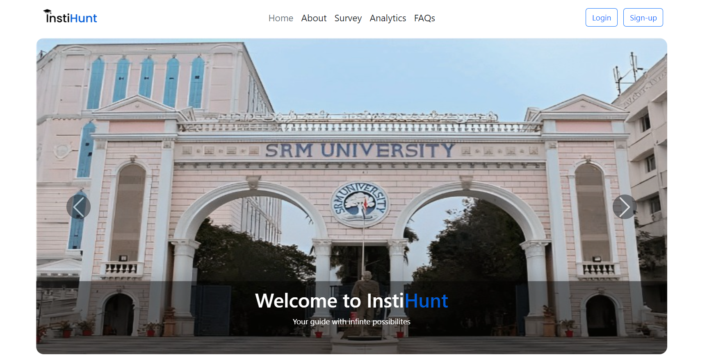
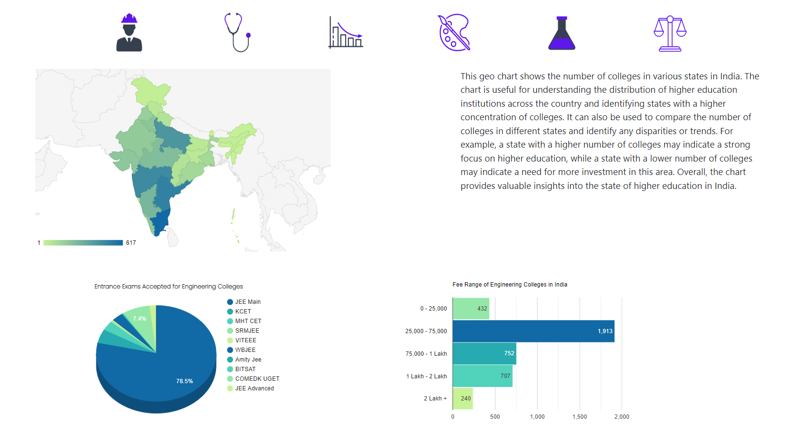
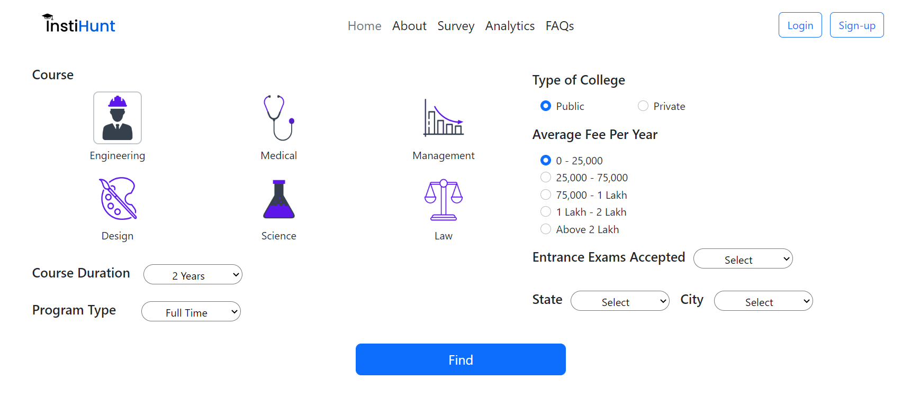

# InstiHunt

<strong> InstiHunt </strong> is a personalised college recommendation system where students can enter the details asked and get recommendations of finest colleges from all over India.

Features provided by InstiHunt : 
<ol>
  <li>Surf and know about the top 50 colleges in 6 different fields which are Engineering, Medical, Arts, Science, Law, Management.
  <li>Take a survey and get the list of top colleges based on your choice.
  <li>View Analytics of different states across India for data like number of colleges, fees range, entrance exam accepted.
</ol>

<h1 align='center'> UI Images of the Website </h1>
<h3 align='center'> HOME PAGE </h3>

<h3 align='center'> ANALYTICS PAGE </h3>

<h3 align='center'> SURVEY PAGE </h3>

# Contributors 

<a href='https://github.com/dvamsidhar2002'>D VAMSIDHAR</a> 
<a href='https://github.com/saipradyumnanprem'>SAI PRADYUMNAN PREM</a> 
<a href='https://github.com/AlankritiKalsi-23'>ALANKRITI KALSI</a> 
<a href='https://github.com/Yaswanthraj9'>YASWANTHRAJ PARTHATIL</a> 
<a href='https://github.com/stevesaju23'>STEVE SAJU</a> 
